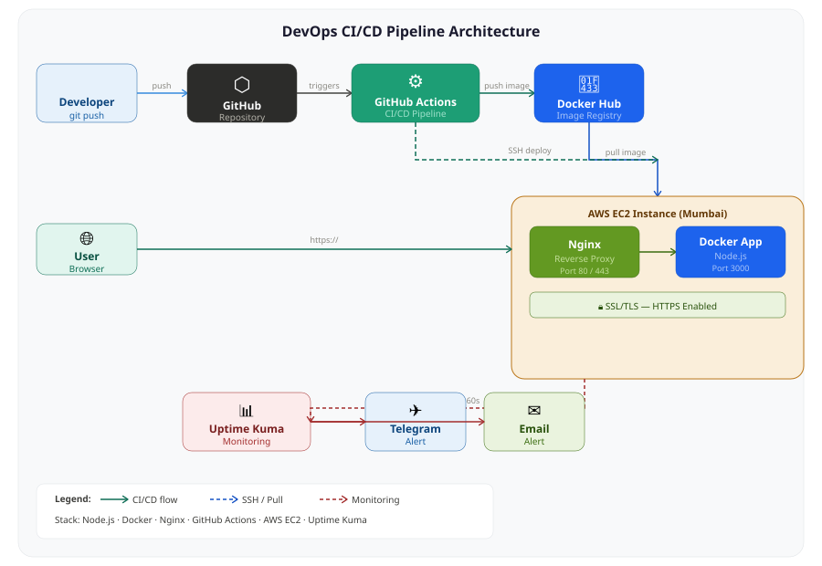

# DevOps CI/CD Pipeline — D. M. D. B. Dissanayake

A complete DevOps pipeline built during industrial training at **Codezela Technologies (Pvt) Ltd**.



---

## Pipeline Flow

```
Code push → GitHub Actions → Docker Hub → EC2 → Nginx → HTTPS → User
                                                    ↑
                                             Uptime Kuma
                                           ↙           ↘
                                       Telegram       Email
```

---

## Stack

| Layer | Technology |
|-------|-----------|
| Runtime | Node.js |
| Containerization | Docker |
| Registry | Docker Hub |
| CI/CD | GitHub Actions |
| Web Server | Nginx (reverse proxy) |
| Cloud | AWS EC2 (Mumbai) |
| SSL | Self-signed / Certbot |
| Monitoring | Uptime Kuma |
| Alerts | Telegram + Email (SMTP) |

---

## Tasks Completed

- ✅ Task 1 — Dockerfile for Node.js app
- ✅ Task 2 — Multi-container setup with Docker Compose
- ✅ Task 3 — GitHub Actions CI pipeline
- ✅ Task 4 — Manual deployment to AWS EC2
- ✅ Task 5 — Nginx reverse proxy (port 80)
- ✅ Task 6 — SSL certificate (HTTPS on port 443)
- ✅ Task 7 — DNS concepts and record types
- ✅ Task 8 — Cloudflare DNS and security
- ✅ Task 9 — Uptime Kuma monitoring with Telegram and Email alerts
- ✅ Task 10 — Full CI/CD auto-deploy to EC2 on git push

---

## How It Works

1. Developer pushes code to GitHub
2. GitHub Actions triggers automatically
3. Builds Docker image and pushes to Docker Hub
4. SSHs into EC2 and pulls the new image
5. Restarts the container with zero manual work
6. Nginx serves the app on port 80/443
7. Uptime Kuma monitors every 60 seconds
8. Telegram and Email alerts fire on any downtime

---

## Local Setup

```bash
git clone https://github.com/Dakshinab/devops-task-10-cicd.git
cd devops-task-10-cicd
docker build -t docker-app .
docker run -d -p 3000:3000 docker-app
```

Visit `http://localhost:3000`

---

## Industrial Training

**Student:** D. M. D. B. Dissanayake  
**Registration:** ITBIN-2211-0180  
**University:** Horizon Campus — Faculty of Information Technology  
**Company:** Codezela Technologies (Pvt) Ltd, Colombo  
**Period:** March 2026 — September 2026  
